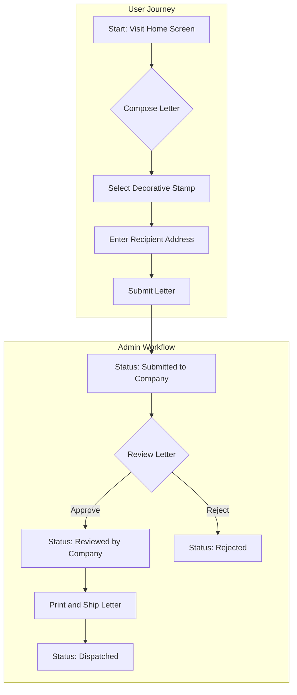

```mermaid
graph TD
    subgraph User Journey
        A[Start: Visit Home Screen] --> B{Compose Letter};
        B --> C[Select Decorative Stamp];
        C --> D[Enter Recipient Address];
        D --> E[Submit Letter];
    end

    subgraph Admin Workflow
        F[Status: Submitted to Company] --> G{Review Letter};
        G -- Approve --> H[Status: Reviewed by Company];
        G -- Reject --> I[Status: Rejected];
        H --> J[Print and Ship Letter];
        J --> K[Status: Dispatched];
    end

    E --> F;
```
